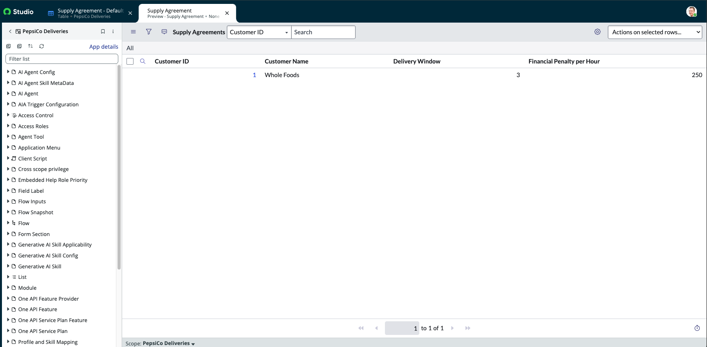
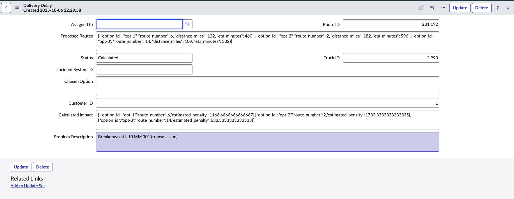

# agentic-logistics-incident-response
An automated supply chain incident processing system that analyzes financial impacts of truck breakdowns, makes optimal routing decisions, and coordinates external execution through AI agents and workflow orchestration.
Required sections:

## System Overview

### When there were delays in PepsiCo's delieveries to tehir customers, a need was identified for an intelligent solution to calculate possible routes and timeng to identify the option that has the least financial impact. The devolpers were task with creating a solution by utulizing agents. 

### The process begins with the custom application, the custom application has tables where  customers and delievery routes data can be captured, recorded to save for calculation and hestorital purposes. After the table and records are made available agents can be created to utilize, analyze and quantify on the data. 

 - Custom Application Image of customer data  

### One agent was created to perform the financial analysis and the second to make a decision be selecting the appropriate route and sending that information into an external agent and the MCP servers to then be actioned upon in a workflow. As each agent performs its task/step the status is updated on the Delivery Route record so the team is aware of its progress through the workflow. 

 - Image of Record With State Changed and calculation populated

### Once all the information has been returned from the agents and a route is selected then it is actioned open by the logistics company and will return the final state of dispateched, from the external AI agent and MCP servers. 

## Implementation Steps 

### Key architectural decisions, AI agent configuration choices, and integration approaches used

## Architecture Diagram
### Visual representation of the complete workflow showing ServiceNow agents, n8n coordination, and external system integration

## Optimization 
### Analysis of how you optimized the system for efficiency, reliability, and performance. Document specific optimizations implemented (such as webhook URL configuration, script efficiency improvements, error handling enhancements, or workflow streamlining) and identify future optimization opportunities (such as caching strategies, parallel processing possibilities, advanced error recovery mechanisms, or enhanced monitoring capabilities).

## Testing Results
### Evidence of successful end-to-end system operation with specific examples of financial analysis, routing decisions, and external execution

## Business Value
### Analysis of how the system improves PepsiCo's supply chain operations, reduces manual intervention, and optimizes delivery cost management
