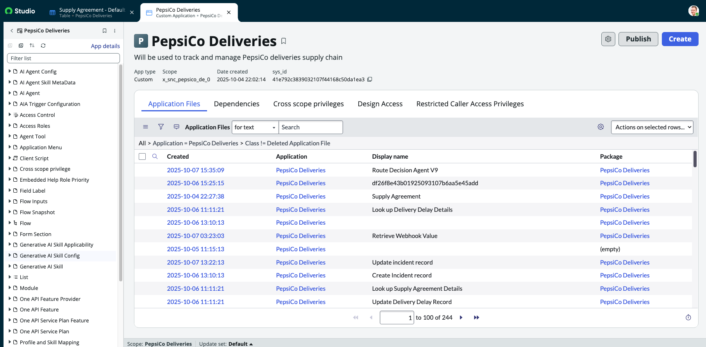
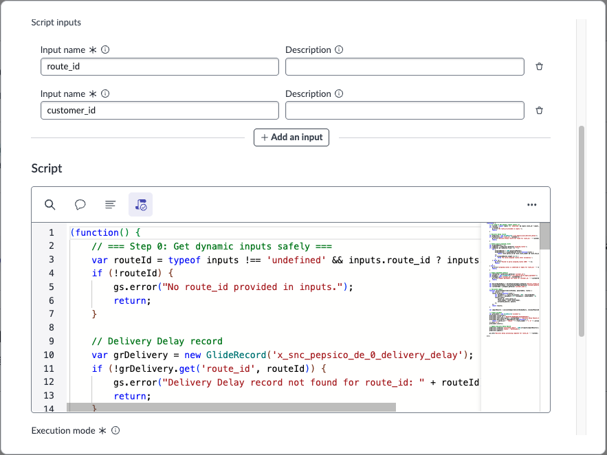
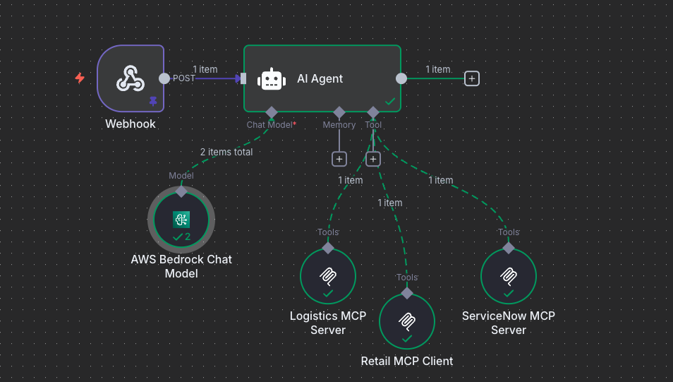

# agentic-logistics-incident-response
An automated supply chain incident processing system that analyzes financial impacts of truck breakdowns, makes optimal routing decisions, and coordinates external execution through AI agents and workflow orchestration.
Required sections:

## System Overview

### When there were delays in PepsiCo's delieveries to tehir customers, a need was identified for an intelligent solution to calculate possible routes and timeng to identify the option that has the least financial impact. The devolpers were task with creating a solution by utulizing agents. 

### The process begins with the custom application, the custom application has tables where  customers and delievery routes data can be captured, recorded to save for calculation and hestorital purposes. After the table and records are made available agents can be created to utilize, analyze and quantify on the data. 

 - Custom Application Image of customer data  

### One agent was created to perform the financial analysis and the second to make a decision be selecting the appropriate route and sending that information into an external agent and the MCP servers to then be actioned upon in a workflow. As each agent performs its task/step the status is updated on the Delivery Route record so the team is aware of its progress through the workflow. 

 - Image of Record With State Changed and calculation populated

### Once all the information has been returned from the agents and a route is selected then it is actioned open by the logistics company and will return the final state of dispateched, from the external AI agent and MCP servers. 

## Implementation Steps 

### Key architectural decisions, AI agent configuration choices, and integration approaches used

### 1. Set up the PepsiCO custom aapplication, including tables with the customer and route data. Test records can be created to for QA of the agents, but ultimately these would be populated with all of the companys data. 

 - Image of the custom application set up from ServiceNow Studio 

### 2. Once data is available in the AI agent studio module the first agent needed is the one to create the financial analysis. To create this agent the following prompting/scripting tools were needed: 
#### 2.1 A script to review the proposed routes data (including estimated delay time and distance)
#### 2.2 A script to also grab the customer contract information to then caltulate estimated penalty costs and input them in the calculated impact field and update the status to calculated

 - Image of Financial Analysis Workflow Srcipting Tool 

### 3. The second agent is needed to review the financial analysis output and make a decision. This was performed using the following tools:
#### 3.1 Look up to the incident record to grab the routeID from the short description
#### 3.2 Prompt to select the lowest cost/financial impact impact option
#### 3.3 Prompt to determine based on cost, its associated urgency (500: Low < 501 - 1000: Medium > 1000: High)
#### 3.4 Update incident record tool to appropriate urgency 
#### 3.5 Update delivery route record tool with chosen option and approved status
#### 3.6 Trigger webhook tool to send chosen option to n8n AI agent 

 - Image of Route Decision Agent Tools

### 4. the final agent in n8n is required to send information externally to the logistic companies MCP and Client/retail MCP so they recieved the updated route inforamiot and can plan accordingly. This was set up by imprementing the following: 
#### 4.1 Webhook trigger node 
#### 4.2 AI agent utilizing the LLM module indicated by AWS bedrock to send data to external MCPs
#### 4.3 Connection to the Logistic (Schnider) MCP
#### 4.4 Connection the the Retail (Whole Foods) MCP
#### 4.4 Connection to the ServiceNow MCP to return delivery message back 

 - Image of n8n

## Architecture Diagram
### Visual representation of the complete workflow showing ServiceNow agents, n8n coordination, and external system integration

## Optimization 
### Analysis of how you optimized the system for efficiency, reliability, and performance. Document specific optimizations implemented (such as webhook URL configuration, script efficiency improvements, error handling enhancements, or workflow streamlining) and identify future optimization opportunities (such as caching strategies, parallel processing possibilities, advanced error recovery mechanisms, or enhanced monitoring capabilities).

## Testing Results
### Evidence of successful end-to-end system operation with specific examples of financial analysis, routing decisions, and external execution

## Business Value
### Analysis of how the system improves PepsiCo's supply chain operations, reduces manual intervention, and optimizes delivery cost management
