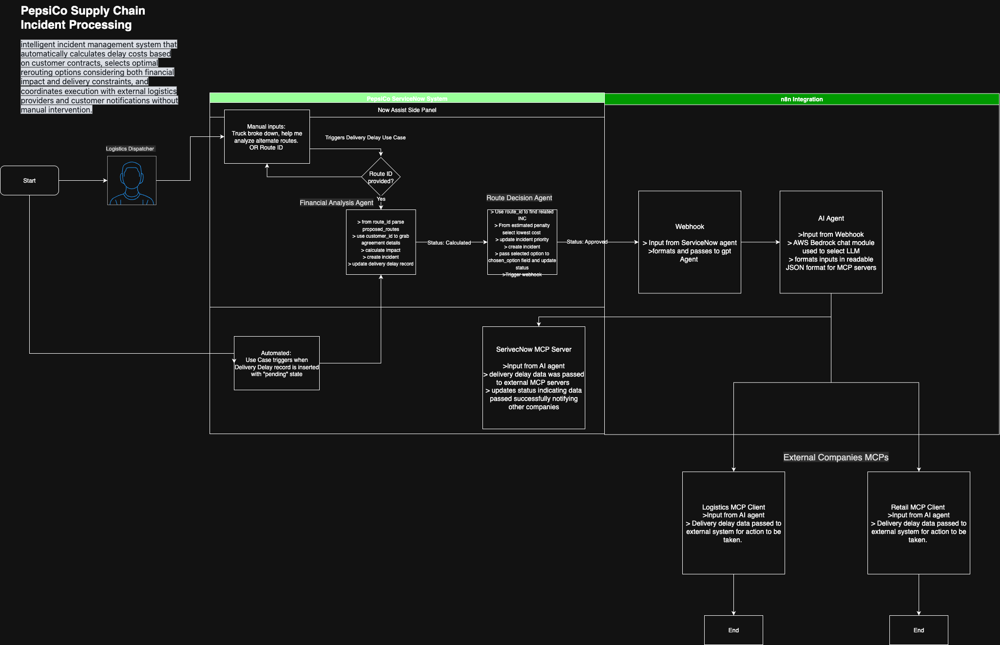

# agentic-logistics-incident-response
An automated supply chain incident processing system that analyzes financial impacts of truck breakdowns, makes optimal routing decisions, and coordinates external execution through AI agents and workflow orchestration.
Required sections:

## System Overview

### Description of the automated supply chain incident processing system and its business impact for PepsiCo operations

## Implementation Steps 
### Key architectural decisions, AI agent configuration choices, and integration approaches used

## Architecture Diagram
### Visual representation of the complete workflow showing ServiceNow agents, n8n coordination, and external system integration

## Optimization 
### Analysis of how you optimized the system for efficiency, reliability, and performance. Document specific optimizations implemented (such as webhook URL configuration, script efficiency improvements, error handling enhancements, or workflow streamlining) and identify future optimization opportunities (such as caching strategies, parallel processing possibilities, advanced error recovery mechanisms, or enhanced monitoring capabilities).

## Testing Results
### Evidence of successful end-to-end system operation with specific examples of financial analysis, routing decisions, and external execution

## Business Value
### Analysis of how the system improves PepsiCo's supply chain operations, reduces manual intervention, and optimizes delivery cost management
