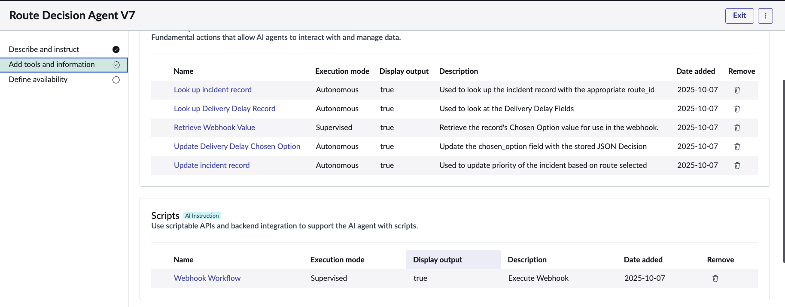
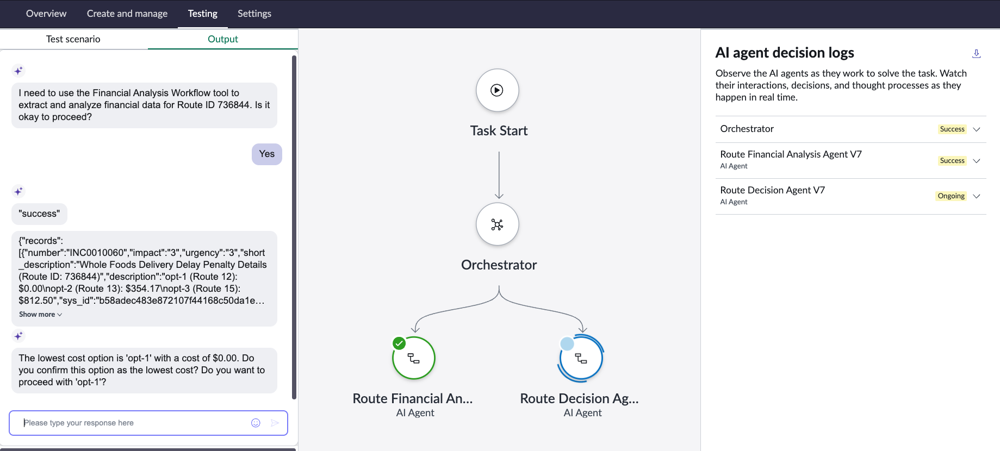
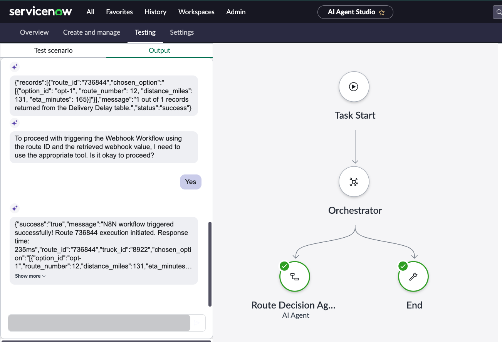
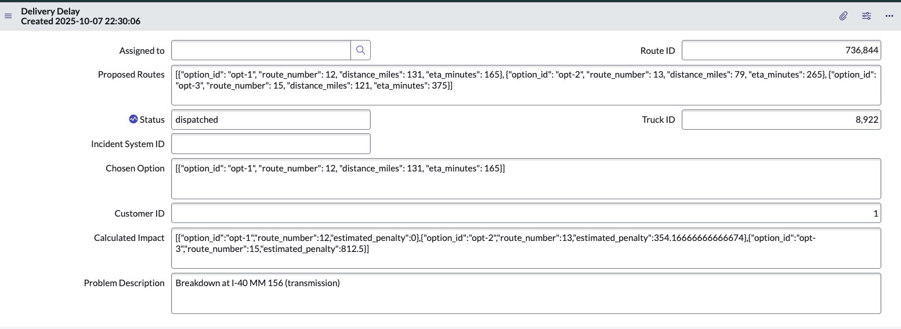

# agentic-logistics-incident-response
An automated supply chain incident processing system that analyzes financial impacts of truck breakdowns, makes optimal routing decisions, and coordinates external execution through AI agents and workflow orchestration.
Required sections:

## System Overview

### When there were delays in PepsiCo's deliveries to its customers, a need was identified for an intelligent solution to calculate possible routes and timing to determine the option that has the least financial impact. The developers were tasked with creating a solution by utilizing agents. 

### The process begins with the custom application, which has tables where customer and delivery route data can be captured, recorded, and saved for calculation and historical purposes. After the table and records are made available, agents can be created to utilize, analyze, and quantify the data. 

 

### One agent was created to perform the financial analysis, and the second to decide by selecting the appropriate route and sending that information to an external agent and the MCP servers to be then actioned upon in a workflow. As each agent performs its task/step, the status is updated on the Delivery Route record so the team is aware of its progress through the workflow. 

 

### Once all the information has been returned from the agents and a route is selected then it is actioned open by the logistics company and will return the final state of dispatched, from the external AI agent and MCP servers. 

## Implementation Steps 

### Key architectural decisions, AI agent configuration choices, and integration approaches used

### 1. Set up the PepsiCO custom application, including tables with the customer and route data. Test records can be created for QA of the agents, but ultimately, these would be populated with all of the company's data. 

 

### 2. Once data is available in the AI agent studio module, the first agent needed is the one to create the financial analysis. To create this agent, the following prompting/scripting tools were needed: 
#### 2.1 A script to review the proposed routes data (including estimated delay time and distance)
#### 2.2 A script to also grab the customer contract information to then calculate estimated penalty costs and input them in the calculated impact field, and update the status to calculated

 

### 3. The second agent is needed to review the financial analysis output and make a decision. This was performed using the following tools:
#### 3.1 Look up the incident record to grab the routeID from the short description
#### 3.2 Prompt to select the lowest cost/financial impact option
#### 3.3 Prompt to determine based on cost, its associated urgency (500: Low < 501 - 1000: Medium > 1000: High)
#### 3.4 Update the incident record tool to the appropriate urgency 
#### 3.5 Update the delivery route record tool with the chosen option and approved status
#### 3.6 Trigger webhook tool to send chosen option to n8n AI agent 

 

### 4. The final agent in n8n is required to send information externally to the logistic companies, MCP, and Client/retail MCP so they recieved the updated route information and can plan accordingly. This was set up by implementing the following: 
#### 4.1 Webhook trigger node 
#### 4.2 AI agent utilizing the LLM module indicated by AWS Bedrock to send data to external MCPs
#### 4.3 Connection to the Logistic (Schnider) MCP
#### 4.4 Connecting to the Retail (Whole Foods) MCP
#### 4.4 Connection to the ServiceNow MCP to return the delivery message 

 

## Architecture Diagram
### Visual representation of the complete workflow showing ServiceNow agents, n8n coordination, and external system integration

 

## Optimization 

### Analysis of how you optimized the system for efficiency, reliability, and performance. Document specific optimizations implemented (such as webhook URL configuration, script efficiency improvements, error handling enhancements, or workflow streamlining) and identify future optimization opportunities (such as caching strategies, parallel processing possibilities, advanced error recovery mechanisms, or enhanced monitoring capabilities).

### 1. Script Updates
#### Was able to script the first tool, but believe the code could be greatly improved. It is lengthy and possibly has redundant code, which allows for optimization. 

#### The first tool was able to be fully scripted, but the second was primarily prompting. As a future enhancement would like the second agent to also primarily be scripted to avoid miscalculations and/or halucinations from the Agent. 

### 2. Add additional agent
#### Recommend utilizing another agent to review/audit the function of the other two to produce accuracy scores. Would revew the others' review of the proposed routes and selected decisions, and perhaps even cross reference the date with other information as dates and location, which could result in predecting trends. By identifying trends, PepsiCo would be able to plan further ahead and either scale up or down effectively. 

## Testing Results

 - Image of Record With State Changed and calculation populated

 - Image of Routing Decision Produced by Decision Tool

 - Image of it capturing and sending with webhook data over 

 - Image of the record that went through the entire process and is dispatched 

## Business Value

### Implementation of this solution, PepsiCo now has quantifiable data on how delivery delays affect their bottom line. If there are scenarios where there are increased delays with a particular logistics company, they will know the dollar value associated and, depending on the impact, look to outsource their business to another logistics company. ULtimately this provides them with additional data they can continue to use to either look at historically and look to identify trends and perform preductions. 
